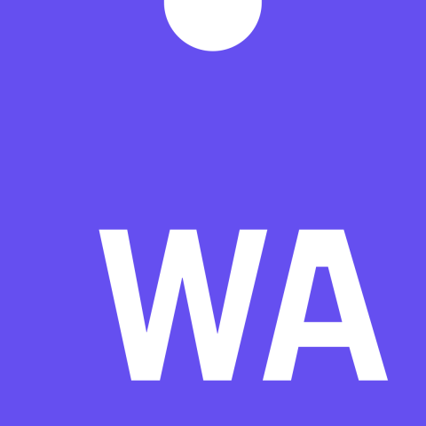
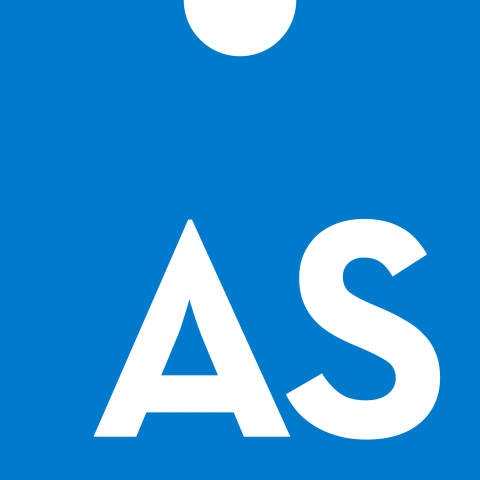

  
<b>Hello there 👋</b>

  
   
  <i>General Kenobi!</i>

<h1 style="font-family: Luminari, fantasy, 'Times New Roman'; letter-spacing: 5px;">MY ARSENAL</h1>
<table>
  <tr style="border: none">
    <td style="border: none"><a href="https://www.javascript.com"><a/></td>
    <td style="border: none"><a href="https://www.typescriptlang.org"><a/></td>
    <td style="border: none"><a href="https://webassembly.org"><a/></td>
    <td style="border: none"><a href="https://www.assemblyscript.org/"><a/></td>
  </tr>
    <tr style="border: none">
    <td style="border: none"><a href="https://v8.dev/"><a/></td>
    <td style="border: none"><a href="https://vuejs.org/"><a/></td>
    <td style="border: none"><a href="https://vitejs.dev/"><a/></td>
    <td style="border: none"><a href="https://maven.apache.org"><a/></td>
  </tr>
  <tr style="border: none">
    <td style="border: none"><a href="https://www.java.com/tr/"><a/></td>
    <td style="border: none"><a href="https://openjfx.io"><a/></td>
    <td style="border: none"><a href="https://spring.io"><a/></td>
    <td style="border: none"><a href="https://p5js.org"><a/></td>
  </tr>
  <tr style="border: none">
    <td style="border: none"><a href="https://nodejs.org/en/"><a/></td>
    <td style="border: none"><a href="https://www.npmjs.com"><a/></td>
    <td style="border: none"><a href="http://expressjs.com"><a/></td>
    <td style="border: none"><a href="https://www.docker.com/"><a/></td>
  </tr>
  <tr style="border: none">
    <td style="border: none"><a href="https://www.mongodb.com"><a/></td>
    <td style="border: none"><a href="https://www.mysql.com"><a/></td>
    <td style="border: none"><a href="https://aws.amazon.com"><a/></td>
    <td style="border: none"><a href="https://d3js.org"><a/></td>
  </tr>
</table>

