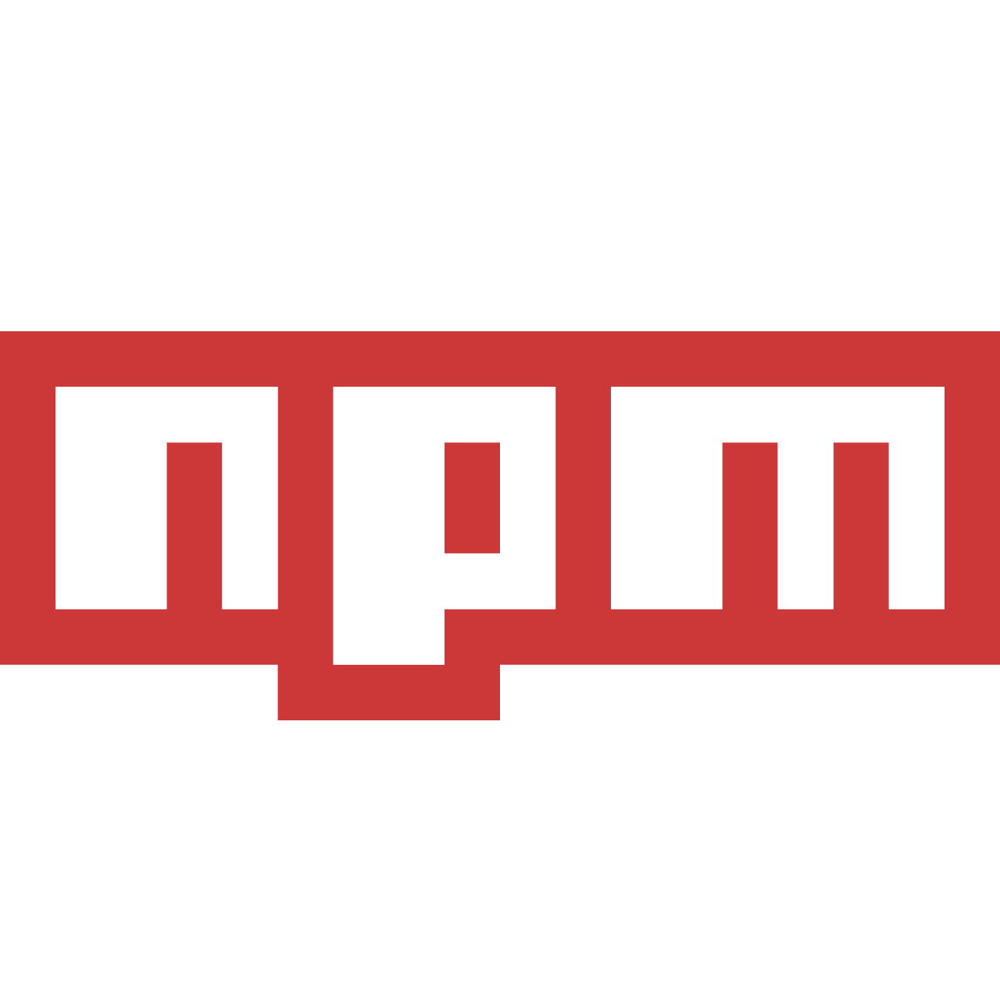
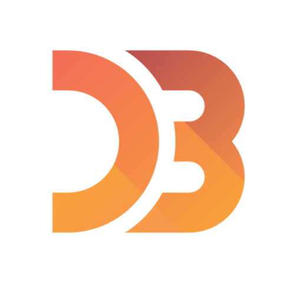
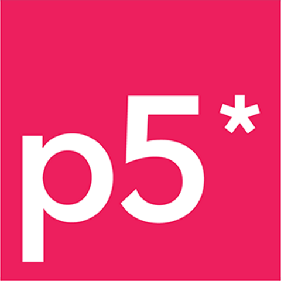

  
<b>Hello there 👋</b>

  
   
  <i>General Kenobi!</i>

<h1 style="font-family: Luminari, fantasy, 'Times New Roman'; letter-spacing: 5px;">MY ARSENAL</h1>
<table>
  <tr style="border: none">
    <td style="border: none"></td>
    <td style="border: none"></td>
    <td style="border: none"></td>
  </tr>
  <tr style="border: none">
    <td style="border: none"></td>
    <td style="border: none"></td>
    <td style="border: none"></td>
  </tr>
  <tr style="border: none">
    <td style="border: none"></td>
    <td style="border: none"></td>
    <td style="border: none"></td>
  </tr>
  <tr style="border: none">
    <td style="border: none"></td>
    <td style="border: none"></td>
    <td style="border: none"></td>
  </tr>
  <tr style="border: none">
    <td style="border: none"></td>
    <td style="border: none"></td>
    <td style="border: none"></td>
  </tr>
</table>

**GokselKUCUKSAHIN/GokselKUCUKSAHIN** is a ✨ _special_ ✨ repository because its `README.md` (this file) appears on your GitHub profile.

Here are some ideas to get you started:

- 🔭 I’m currently working on ...
- 🌱 I’m currently learning ...
- 👯 I’m looking to collaborate on ...
- 🤔 I’m looking for help with ...
- 💬 Ask me about ...
- 📫 How to reach me: ...
- 😄 Pronouns: ...
- ⚡ Fun fact: ...
-->
